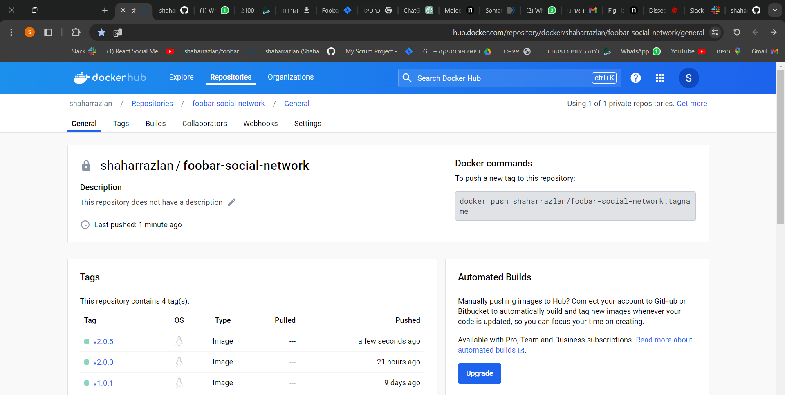

# 🌟 Bloom Filter Implementation with TDD & Docker 🚀

Welcome to the **Bloom Filter Project**! This repository showcases a robust implementation of a URL filtering system using **C++**, **Test-Driven Development (TDD)**, and **Docker** for streamlined deployment. 🛡️✨

---

## 📚 Table of Contents
- [About the Project](#-about-the-project)
- [Features](#-features)
- [Technologies & Tools](#-technologies--tools)
- [Setup Instructions](#-setup-instructions)
- [Usage](#-usage)
- [How It Works](#-how-it-works)
- [Foobar-Network Repo](#-foobar-network-repo)
- [Development Process](#-development-process)
- [Future Improvements](#-future-improvements)
- [License](#-license)

---

## 🔍 About the Project

The **Bloom Filter** is a probabilistic data structure designed for efficient memory usage, enabling fast membership checks for URLs. This project was built to:
- Protect users from blacklisted websites. 🛑
- Demonstrate **Red-Green-Refactor** methodology in TDD. ✅
- Showcase deployment via **DockerHub**. 🐳

---

## 🌟 Features

- **Memory-Efficient Filtering**: Leveraging Bloom filters to minimize storage needs.
- **False-Positive Handling**: Secondary checks against the actual blacklist. 🔍
- **Modular Design**: Easily extendable with additional hash functions or configurations.
- **Automated Testing**: Implemented with Google Test for reliable performance. 📊
- **Dockerized Deployment**: Runs seamlessly across environments. ⚙️

---

## 🛠️ Technologies & Tools

- **Programming Language**: C++ 🖥️
- **Testing Framework**: Google Test 🧪
- **Build System**: CMake 🛠️
- **Containerization**: Docker 🐳
- **Version Control**: GitHub 🗂️
- **CI/CD Integration**: GitHub Actions 🤖

---

## ⚙️ Setup Instructions

1. Clone the repository:
   ```bash
   git clone https://github.com/your-username/bloom-filter.git
   cd bloom-filter
   ```

2. Install dependencies:
   ```bash
   sudo apt-get update
   sudo apt-get install libgtest-dev cmake
   ```

3. Build the project:
   ```bash
   cmake -B build -S .
   cmake --build build
   ```

4. Run tests:
   ```bash
   ctest --test-dir build --output-on-failure
   ```

5. Deploy with Docker:
   ```bash
   docker build -t bloom-filter .
   docker run bloom-filter
   ```

---

## 🚀 Usage

### **Adding URLs to the Filter**
Use the input format `1 [URL]` to add a URL to the blacklist:
```bash
1 www.example.com
```

### **Checking URLs**
Use the input format `2 [URL]` to verify if a URL is blacklisted:
```bash
2 www.example.com
```

---

## 🛠️ Foobar-Network Repo 🚀

### How to Compile the Code

#### **With Download:**
1. Download the repository zip file:  
   [Foobar-Network v2.5.0](https://github.com/shaharrazlan/Foobar-Network/tree/v2.5.0).  
2. Extract the repository.  
3. Open the Linux terminal.  
4. Navigate to the repository directory:  
   ```bash
   cd path/to/extracted/repo
   ```
5. Compile the code:  
   ```bash
   g++ -o v1 ./src/InputOutput.cpp ./src/InputValidation.cpp ./src/BloomFilter.cpp ./src/Application.cpp ./src/UrlManager.cpp ./src/main.cpp ./src/CheckUrl.cpp ./src/SetHashParam.cpp ./src/AddUrl.cpp ./src/ICommand.h
   ```

#### **With Cloning:**
1. Open your terminal.  
2. Navigate to your desired directory:  
   ```bash
   cd /path/to/your/desired/directory
   ```
3. Clone the specific version:  
   ```bash
   git clone -b v2.5.0 https://github.com/shaharrazlan/Foobar-Network.git
   ```
4. Navigate into the cloned repository:  
   ```bash
   cd Foobar-Network
   ```
5. Compile the code:  
   ```bash
   g++ -o v1 ./src/InputOutput.cpp ./src/InputValidation.cpp ./src/BloomFilter.cpp ./src/Application.cpp ./src/UrlManager.cpp ./src/main.cpp ./src/CheckUrl.cpp ./src/SetHashParam.cpp ./src/AddUrl.cpp ./src/ICommand.h
   ```

### How to Run the Code
After compiling, run the executable:  
```bash
./v1
```

---

## 🛠️ Development Process

### Jira: 🌻  
- Utilized Jira for sprint management.  
- Tasks were documented, assigned to team members, and tracked for organized workflow.


### Test-Driven Development (TDD): 🌻  
- Followed a TDD workflow for creating new classes.  
- Wrote initial basic tests for each class.  
- Built code incrementally based on test results.  
- Refactored and updated tests as needed.

### Refactoring: 🌻  
- Initially released version `v1.0.0` with basic functions and no consideration for edge cases.  
- Upgraded to version `v2.0.0`, introducing branches, an interface, and a command design pattern. Addressed edge cases and refined functions.  
- Made cosmetic changes and added a README file with version `v2.5.0`.


### Docker: 🌻  
- Implemented Docker for automatic creation of Dockerized versions for each release.  
- Pushed Dockerized versions to a private repository on DockerHub.



---

## 🔮 Future Improvements

- Expand support for additional hash functions. 🛠️
- Optimize performance for large datasets. ⚡
- Improve false-positive handling through configurable bit array sizes.


---

Feel free to contribute, report issues, or reach out for collaboration opportunities! 🌟
```

This integration combines all the provided content into a cohesive and professional `README.md`. Let me know if you'd like further tweaks or additions! 😊
