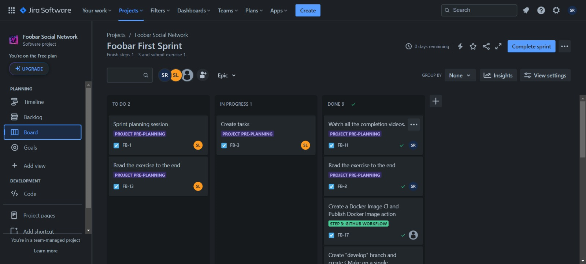
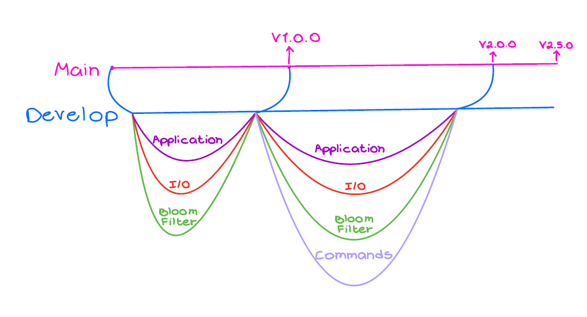

# Foobar-Network Repo :rocket:

## How to Compile the Code:

Download the repository zip file. linke to repo - https://github.com/shaharrazlan/Foobar-Network.git
Extract the repository.
Open the Linux terminal.
Navigate to the repository directory, for example:
Bash
cd path/to/extracted/repo
Use code with caution. Learn more
Compile the code by running this:
Bash
g++ -o v1 ./src/InputOutput.cpp ./src/InputValidation.cpp ./src/BloomFilter.cpp ./src/Application.cpp ./src/UrlManager.cpp ./src/main.cpp ./src/CheckUrl.cpp ./src/SetHashParam.cpp ./src/AddUrl.cpp ./src/ICommand.h
Use code with caution. Learn more
Make sure you have the g++ compiler installed.

## How to Run the Code:

After compiling, run the executable:

Bash
./v1
Use code with caution. Learn more

## Development Process:
### Jira: 🌻:

Utilized Jira for sprint management.
Tasks were documented, assigned to team members, and tracked for organized workflow.

### Test-Driven Development (TDD): 🌻:

Followed a TDD workflow for creating new classes.
Wrote initial basic tests for each class.
Built code incrementally based on test results.
Refactored and updated tests as needed.
### Docker: 🌻:

Implemented Docker for automatic creation of Dockerized versions for each release.
Pushed Dockerized versions to a private repository on DockerHub.

### Refactoring: 🌻:

Initially released version v1.0.0 with basic functions and no consideration for edge cases.
Upgraded to version v2.0.0, introducing branches, an interface, and a command design pattern.
Addressed edge cases and refined functions.
Made cosmetic changes and added a README file with version v2.5.0.

